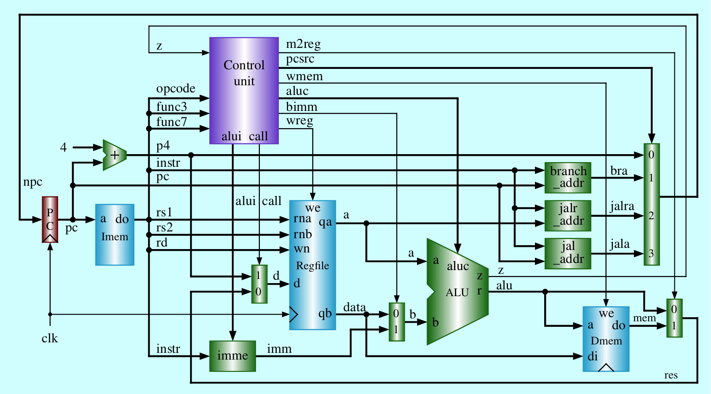

# RISC-V CPU Implementation

This repository contains implementations of **Single-Cycle** and **Pipelined** CPUs based on the RISC-V instruction set architecture (ISA). These designs demonstrate fundamental concepts of computer architecture such as control units, data paths, and hazard handling.

---

## Table of Contents

1. [Single-Cycle CPU](#single-cycle-cpu)
   - [Directory Structure](#directory-structure-single-cycle)
   - [CPU Design](#cpu-design-single-cycle)
   - [Control Unit Signals](#control-unit-signals)
2. [Pipelined CPU](#pipelined-cpu)
   - [Directory Structure](#directory-structure-pipelined)
   - [CPU Design](#cpu-design-pipelined)
   - [Hazard Handling](#hazard-handling)
3. [References](#references)

---

## Single-Cycle CPU

The **Single-Cycle CPU** executes each instruction in a single clock cycle, offering simplicity in design but with limited performance due to the clock cycle being bound by the slowest instruction.

### Directory Structure (Single-Cycle)
<pre>
├── CPU (sc_computer.v)
│   ├── Core (sc_cpu.v)
│   │   ├── alu.v
│   │   ├── branch_addr.v
│   │   ├── jal_addr.v
│   │   ├── jalr_addr.v
│   │   ├── imme.v
│   │   ├── dff32.v
│   │   ├── regfile.v
│   │   ├── pc4.v
│   │   ├── mux2x32.v
│   │   ├── mux4x32.v
│   │   ├── sc_cu.v
│   ├── Data Memory (sc_datamem.v)
│   ├── Instruction Memory (sc_instmem.v)
</pre>

### CPU Design (Single-Cycle)
- **32-bit computing** based on the RISC-V instruction set architecture.
- Executes one instruction per clock cycle.
- Key modules:
  - **Control Unit:** Generates control signals based on the instruction opcode.
  - **ALU:** Performs arithmetic and logic operations.
  - **Data Path:** Connects instruction memory, data memory, and the register file.
  
**Diagram**  

---

### Control Unit Signals
The control unit generates the following key signals:

| Signal       | Function                                         |
|--------------|--------------------------------------------------|
| `pcsrc[1:0]` | Selects next program counter address.            |
| `bimm`       | Controls immediate value selection.             |
| `alui[1:0]`  | Determines immediate value type for instructions.|
| `wreg`       | Enables register writes.                        |
| `call`       | Selects write-back data source (PC+4 or ALU).    |
| `m2reg`      | Selects memory data for write-back.             |
| `wmem`       | Enables memory writes.                          |

Refer to the source code for detailed signal configurations for specific instructions.

---

## Pipelined CPU

The **Pipelined CPU** divides instruction execution into five stages, increasing instruction throughput by overlapping execution. It implements hardware-based hazard handling to manage pipeline conflicts.

### Directory Structure (Pipelined)
<pre>
├── CPU (pl_computer.v)
│   ├── Instruction Fetch (pl_stage_if.v)
│   │   ├── pc4.v
│   │   ├── mux4x32.v
│   │   ├── pl_instmem.v
│   ├── Instruction Decode (pl_stage_id.v)
│   │   ├── regfile.v
│   │   ├── branch_addr.v
│   │   ├── jal_addr.v
│   │   ├── jalr_addr.v
│   │   ├── equ.v
│   │   ├── imme.v
│   │   ├── mux2x32.v
│   │   ├── pl_cu.v
│   ├── Execute (pl_stage_exe.v)
│   │   ├── alu.v
│   │   ├── mux2x32.v
│   ├── Memory Access (pl_stage_mem.v)
│   │   ├── pl_datamem.v
│   ├── Write Back (pl_stage_wb.v)
│   │   ├── mux2x32.v
</pre>

### CPU Design (Pipelined)
- **32-bit computing** based on the RISC-V instruction set architecture.
- Transforms the single-cycle CPU into a pipelined architecture for higher throughput.
- Divided into **five stages**:
  1. **Instruction Fetch (IF)**
  2. **Instruction Decode (ID)**
  3. **Execute (EXE)**
  4. **Memory Access (MEM)**
  5. **Write Back (WB)**

**Diagram**  

---

### Hazard Handling
The pipelined CPU handles the following hazards:

#### **1. Structural Hazard**
- Divides memory into **instruction memory** and **data memory**.
- Separates register file into distinct **read** and **write ports**.

#### **2. Control Hazard**
- Moves branch address calculation (`mux4x32.v`) to the **IF stage**.
- Adds a dedicated equality-check module (`equ.v`) in the **ID stage** to determine branch conditions.

#### **3. Data Hazard**
- Implements **forwarding** and **stalling** mechanisms to resolve data dependencies between instructions.

---

## References

- Yamin Li. *Computer Organization and Design*. Lecture presented at Hosei University, Fall 2023. [Link](https://yamin.cis.k.hosei.ac.jp/lectures/cod/)

---

  
